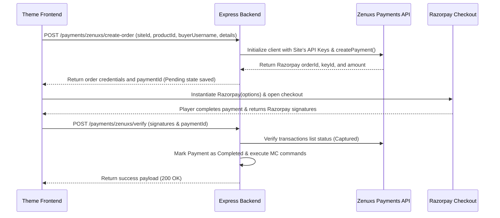

# 🔌 Zenuxs MC Web Builder — Multi-Tenant Theme API Reference

Welcome to the Zenuxs MC Web Builder backend integration handbook. This specification serves as a comprehensive reference guide for creating fully customizable frontends and themes (e.g., Classic, Titan, Cyber-Punk) connected to our multi-tenant SaaS platform.

Every API endpoint detailed below is fully structured, complete with request body schemas, header descriptions, response codes, and production-grade JSON examples for quick ingestion by AI coders or developers.

---

## 🏗️ Core Architecture & Site Resolution

All themes operate on a multi-tenant model. The backend resolves the active store/site configuration dynamically using a unique hexadecimal identifier called the **Site Key** (`siteKey`).

- **Base URL**: `http://localhost:5000/api` (for local development)
- **Production URL**: `https://api.yourdomain.com/api`
- **Key Injection**: The frontend theme resolves the platform tenant configuration by passing the `siteKey` via the URL in the site endpoint:
  ```typescript
  const SITE_KEY = process.env.NEXT_PUBLIC_SITE_KEY; // Unique per site
  ```

---

## 📂 1. Basic & General Site Endpoints

### 1.1 Get Site Configuration
Fetches the entire custom design tokens, metadata, social links, SEO configurations, and modules enabled for the active tenant.

- **Endpoint**: `GET /sites/key/:siteKey`
- **Authentication**: `Public` (None)
- **Response Codes**:
  - `200 OK`: Site resolved successfully.
  - `404 Not Found`: Invalid or expired site key.
  
#### Request Example:
`GET http://localhost:5000/api/sites/key/1031d301f914b747ff9fc6d4e011c210`

#### Complete Field Specification:

| Field Path | Type | Description |
| :--- | :--- | :--- |
| `_id` | `string` | MongoDB identifier of the site. |
| `name` | `string` | Minecraft server network/community name. |
| `subdomain` | `string` | Unique subdomain registered (e.g. `titancraft` for `titancraft.zenuxs.me`). |
| `siteKey` | `string` | Hexadecimal site identifier key. |
| `serverIp` | `string` | Minecraft server connection IP (e.g. `play.titancraft.net`). |
| `customDomain` | `string` | Optional domain linked by merchant (e.g. `shop.titancraft.net`). |
| **`theme`** | `object` | Styling design tokens & color scheme configurations. |
| `theme.primaryColor` | `string` | HEX code for core brand color (buttons, highlights, links). |
| `theme.secondaryColor` | `string` | HEX code for dark accent borders, block backgrounds, card header. |
| `theme.backgroundColor` | `string` | HEX code for main background of body layouts. |
| `theme.textColor` | `string` | HEX code for standard texts, titles, subheadings. |
| `theme.buttonStyle` | `string` | Button corners styling variant: `'rounded'`, `'square'`, or `'pill'`. |
| `theme.font` | `string` | Body font family imported (e.g., `'Inter'`, `'Outfit'`). |
| `theme.fontSizeBase` | `string` | Default base document typography size (e.g. `'16px'`). |
| `theme.headingFont` | `string` | Headline title font family (e.g., `'Space Grotesk'`). |
| `theme.borderRadius` | `string` | Global border-radius utility setting (e.g. `'12px'`). |
| `theme.containerWidth` | `string` | Styling width layout constraints (e.g. `'1200px'`). |
| **`socialLinks`** | `object` | Handles social link icon references. |
| `socialLinks.discord` | `string` | Discord invite link. |
| `socialLinks.youtube` | `string` | YouTube channel link. |
| `socialLinks.instagram` | `string` | Instagram handle link. |
| `socialLinks.twitter` | `string` | Twitter/X account link. |
| **`seo`** | `object` | Main index metadata. |
| `seo.title` | `string` | Title tag string. |
| `seo.description`| `string` | Description meta tag. |
| **`authSettings`** | `object` | Controls Advanced Player Auth permissions. |
| `authSettings.enabled`| `boolean` | If `true`, enable the client registration/login buttons and forum posts creation. |
| `authSettings.apiKey` | `string` | Server public auth integration token. |
| **`paymentSettings`**| `object` | Store checkout parameters. |
| `paymentSettings.paymentEnabled` | `boolean` | If `true`, payment checkout buttons are interactive. |
| `paymentSettings.zenuxsPaymentHandle` | `string` | Merchant Zenuxs checkout identifier handle. |
| **`statusHistory`** | `array` | Keeps the last 50 scan records for live uptime latency monitoring. |
| `statusHistory[].online` | `boolean` | Uptime scan result. |
| `statusHistory[].latency` | `number` | Ping roundtrip time in milliseconds. |
| `statusHistory[].players` | `number` | Count of online players recorded at scan time. |
| `statusHistory[].timestamp` | `string` | Date string when status update was triggered. |

#### Response Payload (200 OK):
```json
{
  "_id": "6644f77626efad4a94639900",
  "name": "Titan Craft",
  "subdomain": "titancraft",
  "siteKey": "1031d301f914b747ff9fc6d4e011c210",
  "serverIp": "play.titancraft.net",
  "theme": {
    "primaryColor": "#ef4444",
    "secondaryColor": "#1e293b",
    "backgroundColor": "#09090b",
    "textColor": "#fafafa",
    "buttonStyle": "pill",
    "font": "Space Grotesk",
    "fontSizeBase": "16px",
    "headingFont": "Space Grotesk",
    "borderRadius": "16px",
    "containerWidth": "1200px"
  },
  "socialLinks": {
    "discord": "https://discord.gg/titancraft",
    "youtube": "https://youtube.com/@titancraft",
    "instagram": "https://instagram.com/titancraft",
    "twitter": "https://twitter.com/titancraft"
  },
  "seo": {
    "title": "Titan Craft - The Premium PvP Server",
    "description": "Join the premier Minecraft multiplayer network. Custom kits, pvp games, and awesome active communities."
  },
  "authSettings": {
    "enabled": true,
    "apiKey": "pub_auth_titen_7894378"
  },
  "paymentSettings": {
    "paymentEnabled": true,
    "zenuxsPaymentHandle": "titancraft"
  },
  "externalApi": {
    "serverId": "titancraft_srv_1"
  },
  "statusHistory": [
    {
      "online": true,
      "latency": 42,
      "players": 142,
      "timestamp": "2026-05-17T13:45:00.000Z",
      "_id": "6644f77626efad4a946399a1"
    },
    {
      "online": true,
      "latency": 38,
      "players": 139,
      "timestamp": "2026-05-17T13:40:00.000Z",
      "_id": "6644f77626efad4a946399a2"
    }
  ],
  "createdAt": "2026-05-14T07:00:00.000Z",
  "updatedAt": "2026-05-17T14:15:00.000Z"
}
```

---

### 1.2 Get All Site Pages
Fetches the active menu items, slugs, and layout blocks configured for the site theme.

- **Endpoint**: `GET /pages/site/:siteId`
- **Authentication**: `Public` (None)
- **Response Payload (200 OK)**:
```json
[
  {
    "_id": "6644f77626efad4a94639901",
    "siteId": "6644f77626efad4a94639900",
    "title": "Home",
    "slug": "home"
  },
  {
    "_id": "6644f77626efad4a94639902",
    "siteId": "6644f77626efad4a94639900",
    "title": "Store",
    "slug": "store"
  },
  {
    "_id": "6644f77626efad4a94639903",
    "siteId": "6644f77626efad4a94639900",
    "title": "About Us",
    "slug": "about"
  },
  {
    "_id": "6644f77626efad4a94639904",
    "siteId": "6644f77626efad4a94639900",
    "title": "Forums",
    "slug": "discussions"
  }
]
```

---

### 1.3 Get Single Page Layout
Fetches full section models for rendering a specific page template based on slug (e.g., `home`, `about`, `faq`, `store`, `discussions`).

- **Endpoint**: `GET /pages/:siteId/:slug`
- **Authentication**: `Public` (None)
- **Response Payload (200 OK)**:
```json
{
  "_id": "6644f77626efad4a94639901",
  "siteId": "6644f77626efad4a94639900",
  "title": "Home",
  "slug": "home",
  "sections": [
    {
      "_id": "6644f77626efad4a9463990a",
      "type": "Hero",
      "visible": true,
      "order": 0,
      "styles": {
        "paddingY": "120px",
        "alignment": "center"
      },
      "backgroundImage": "https://titancraft.net/assets/hero-bg.jpg",
      "backgroundStyle": "cover",
      "content": {
        "title": "Welcome to Titan Craft",
        "subtitle": "Unparalleled PvP combat and custom game mechanics.",
        "buttonText": "Join Network",
        "buttonUrl": "#join"
      }
    },
    {
      "_id": "6644f77626efad4a9463990b",
      "type": "ServerStats",
      "visible": true,
      "order": 1,
      "content": {
        "heading": "Uptime & Server Status",
        "serverIp": "play.titancraft.net"
      }
    }
  ],
  "seo": {
    "title": "Home - Titan Craft",
    "description": "Welcome to our homepage."
  }
}
```

---

### 🖼️ 1.3.1 Specification of Page Section Types & Content Schemas
When a theme loads page layouts via `/api/pages/:siteId/:slug`, it iterates through `sections[]` and uses the corresponding renderer based on `type`.

Here is the exact `content` structure for every section `type` defined in the platform's visual builder:

#### 1. `Hero`
A premium top introduction block containing banners, core headlines, call-to-actions, and background designs.
```json
{
  "title": "Welcome to Titan Craft",
  "subtitle": "Join the premier Minecraft multiplayer network.",
  "buttonText": "Explore Store",
  "buttonUrl": "/store",
  "secondaryButtonText": "Join Discord",
  "secondaryButtonUrl": "https://discord.gg/titancraft"
}
```

#### 2. `ServerStats`
Shows live server IP copy box and uptime history widgets using the site's `statusHistory`.
```json
{
  "heading": "Live Server Network",
  "serverIp": "play.titancraft.net",
  "showUptime": true,
  "showLatency": true
}
```

#### 3. `OnlinePlayers`
A block that shows avatars and heads of players currently connected to the server.
```json
{
  "title": "Active Players Right Now",
  "limit": 12,
  "avatarStyle": "3d-head" // "2d", "3d-head", or "body"
}
```

#### 4. `Store`
Renders direct featured items/products categories on the homepage layout.
```json
{
  "title": "Featured Ranks & Packages",
  "categoryFilter": "Ranks",
  "limit": 3
}
```

#### 5. `Leaderboard`
Displays competitive server highscores (e.g. top killers, most active hours, top buyers).
```json
{
  "title": "Top Network Legends",
  "statName": "Kills", // "Kills", "Wins", "Coins"
  "limit": 10
}
```

#### 6. `Forms`
Displays applications, support, or recruiting forms.
```json
{
  "title": "Moderator Applications",
  "formId": "6644fa2226efad4a946399a0"
}
```

#### 7. `Announcements`
Renders news updates, changelogs, or server development blogs.
```json
{
  "title": "Network News & Patches",
  "limit": 3
}
```

#### 8. `Text`
Standard rich markdown or WYSIWYG text layout block for custom "About" or informational contents.
```json
{
  "title": "About Our Network",
  "body": "Titan Craft was founded in 2024 with a simple goal: to build the most balanced PvP server in the world. We offer custom-made game plugins, secure infrastructure, and 24/7 dedicated support."
}
```

#### 9. `Gallery`
Displays server screenshot slides, art banners, or player build highlights.
```json
{
  "title": "Server Showcase",
  "images": [
    { "url": "https://titancraft.net/img/screenshot1.jpg", "caption": "Our Custom Spawn Castle" },
    { "url": "https://titancraft.net/img/screenshot2.jpg", "caption": "Epic KOTH Battles" }
  ]
}
```

#### 10. `Features`
Cards grid explaining server perks, game modes, or why players should choose this network.
```json
{
  "title": "Why Play On Titan Craft?",
  "features": [
    { "icon": "⚡", "title": "Zero Lag", "description": "Running on Ryzen 9 7950X dedicated nodes." },
    { "icon": "⚔️", "title": "Custom Kits", "description": "Dozens of balanced kits crafted by competitive players." }
  ]
}
```

#### 11. `Team`
Staff layout grids showing administrators, developers, and moderators.
```json
{
  "title": "Server Founders & Administrators",
  "members": [
    { "name": "Admin_Titen", "role": "Owner & Lead Dev", "avatar": "https://minotar.net/avatar/Admin_Titen/100" },
    { "name": "Steve", "role": "Community Manager", "avatar": "https://minotar.net/avatar/Steve/100" }
  ]
}
```

#### 12. `FAQ`
Frequently Asked Questions accordion section.
```json
{
  "title": "Frequently Asked Questions",
  "faqs": [
    { "question": "How do I join the server?", "answer": "Open Minecraft, select Multiplayer, add Server IP: play.titancraft.net." },
    { "question": "What should I do if my payment fails?", "answer": "Please raise a ticket in our official Discord server, and support staff will assist you in minutes." }
  ]
}
```

#### 13. `Discussions`
Renders forum feeds and community boards.
```json
{
  "title": "Community General Discussions",
  "limit": 5
}
```

#### 14. `Custom`
Provides custom raw HTML/CSS custom coding blocks.
```json
{
  "html": "<div class='custom-card-widget'><h3>Special Event Active!</h3><p>Log in today to get 2x coin multiplier boosters!</p></div>"
}
```

---

### 1.4 Get Store Products
Retrieves all active digital store products (ranks, unbans, game currencies) configured by the site owner.

- **Endpoint**: `GET /store/products?siteId=:siteId` (Also matches: `GET /store/:siteId`)
- **Authentication**: `Public` (None)
- **Response Payload (200 OK)**:
```json
[
  {
    "_id": "6644f80026efad4a94639950",
    "siteId": "6644f77626efad4a94639900",
    "name": "Titanium Rank",
    "description": "Unlock infinite fly access, exclusive kits, a bright red titanium rank prefix, and a lobby particle trail.",
    "price": 199,
    "category": "Ranks",
    "commands": [
      "/lp user {username} parent add titanium"
    ],
    "createdAt": "2026-05-14T07:15:00.000Z"
  }
]
```

---

### 1.5 Get Server Live Status
We query Minecraft's standard public API to gather online player counts, avatars, MOTDs, and latencies.

- **Endpoint**: `GET https://api.mcsrvstat.us/2/:serverIp`
- **Authentication**: `Public` (None)
- **Response Example**:
```json
{
  "online": true,
  "ip": "127.0.0.1",
  "port": 25565,
  "players": {
    "online": 432,
    "max": 1000,
    "list": ["Steve", "Alex", "Notch"]
  },
  "version": "1.20.4",
  "motd": {
    "clean": [
      "Titan Craft Network - [1.20.4]",
      "3X COINS BOOST WEEKEND ACTIVE!"
    ]
  }
}
```

---

### 1.6 Custom Interactive Forms

#### Get Form Structure
- **Endpoint**: `GET /forms/:siteId`
- **Response (200 OK)**:
```json
[
  {
    "_id": "6644fa2226efad4a946399a0",
    "siteId": "6644f77626efad4a94639900",
    "title": "Staff Application",
    "description": "Apply to become a moderator on the Titan Craft network.",
    "fields": [
      {
        "name": "age",
        "label": "How old are you?",
        "type": "number",
        "required": true
      },
      {
        "name": "experience",
        "label": "Describe your previous staff experience",
        "type": "textarea",
        "required": true
      }
    ]
  }
]
```

#### Submit Form Response
- **Endpoint**: `POST /forms/:formId/submit`
- **Request Payload**:
```json
{
  "data": {
    "age": 19,
    "experience": "I was an Admin on PrimeCraft for 8 months."
  }
}
```
- **Response (201 Created)**:
```json
{
  "success": true,
  "message": "Response submitted successfully!"
}
```

---

### 1.7 Forum Discussions & Threads

#### Get All Threads
- **Endpoint**: `GET /discussions/:siteId`
- **Response (200 OK)**:
```json
[
  {
    "_id": "6644fb8826efad4a946399c0",
    "siteId": "6644f77626efad4a94639900",
    "title": "Official Season 5 Updates",
    "content": "Season 5 launches this Saturday! Prepare for new maps and dynamic kit layouts.",
    "authorName": "Admin_Titen",
    "likes": 42,
    "views": 184,
    "comments": [
      {
        "_id": "6644fbc026efad4a946399c5",
        "authorName": "Steve",
        "content": "Can't wait for this! Let's go!",
        "likes": 5,
        "createdAt": "2026-05-14T08:12:00.000Z"
      }
    ],
    "createdAt": "2026-05-14T08:00:00.000Z"
  }
]
```

#### Create Post Thread
- **Endpoint**: `POST /discussions`
- **Request Payload**:
```json
{
  "siteId": "6644f77626efad4a94639900",
  "title": "Looking for a Factions Team",
  "content": "My IGN is Steve. I'm a good builder and PvPer. Dm me!",
  "authorName": "Steve"
}
```

#### Add Comment
- **Endpoint**: `POST /discussions/:postId/comments`
- **Request Payload**:
```json
{
  "authorName": "Alex",
  "content": "I'm down to team up! My Discord is Alex#0001"
}
```

#### Like Post
- **Endpoint**: `POST /discussions/:postId/like`
- **Request Payload**: `None`
- **Response (200 OK)**: Returns the updated Post thread object.

---

## 🔐 2. Advanced Player Auth (Authentication)

Themes with Advanced Auth enabled provide a secure portal where players register, log in, and bind their session tokens.

### 2.1 Register Player
Registers a player on the server storefront.

- **Endpoint**: `POST /auth/register`
- **Request Payload**:
```json
{
  "username": "Steve",
  "email": "steve@mojang.com",
  "password": "secretpassword123"
}
```
- **Response (201 Created)**:
```json
{
  "token": "eyJhbGciOiJIUzI1NiIsInR5cCI6IkpXVCJ9..."
}
```

---

### 2.2 Login Player
Logs in an existing player.

- **Endpoint**: `POST /auth/login`
- **Request Payload**:
```json
{
  "email": "steve@mojang.com",
  "password": "secretpassword123"
}
```
- **Response (200 OK)**:
```json
{
  "token": "eyJhbGciOiJIUzI1NiIsInR5cCI6IkpXVCJ9..."
}
```

---

### 2.3 Get Current Player Profile
Retrieves the profile data of the logged-in player.

- **Endpoint**: `GET /auth/me`
- **Headers**:
  - `Authorization: Bearer <token>`
- **Response (200 OK)**:
```json
{
  "_id": "6644f70026efad4a94639800",
  "username": "Steve",
  "email": "steve@mojang.com",
  "avatar": "https://minotar.net/avatar/Steve/100",
  "createdAt": "2026-05-14T06:30:00.000Z"
}
```

---

### 2.4 Zenuxs OAuth Single Sign-On (SSO)
Verify an OAuth callback code or verify session tokens directly using Zenuxs global login.

- **Endpoint**: `POST /auth/oauth`
- **Request Payload**:
```json
{
  "zenuxsId": "znx_user_8783478",
  "email": "steve@mojang.com",
  "username": "Steve",
  "picture": "https://avatar.zenuxs.in/znx_user_8783478.png",
  "accessToken": "eyJhbGci..."
}
```
- **Response (200 OK)**:
```json
{
  "token": "eyJhbGciOiJIUzI1NiIsInR5cCI6IkpXVCJ9..."
}
```

---

## 💳 3. Payments (Store Purchases & Checkout)

The purchase flow follows a secure, server-driven protocol using **Zenuxs Payments SDK** backed by the Razorpay Checkout gateway.



### 3.1 Create Checkout Order
Requests a secure payment checkout session from Zenuxs Payments for a store package.

- **Endpoint**: `POST /payments/zenuxs/create-order`
- **Authentication**: `Public` (None)
- **Request Payload**:
```json
{
  "siteId": "6644f77626efad4a94639900",
  "productId": "6644f80026efad4a94639950",
  "buyerUsername": "Steve",
  "payerName": "Aarav Sharma",
  "payerEmail": "aarav@sharma.in",
  "payerContact": "9876543210",
  "note": "Purchase: Titanium Rank (Steve)"
}
```

#### Field Schema Table:
| Field Name | Type | Required | Description |
| :--- | :--- | :--- | :--- |
| `siteId` | `string` | **Yes** | MongoDB ID of the active website. |
| `productId` | `string` | **Yes** | MongoDB ID of the purchased product package. |
| `buyerUsername` | `string` | **Yes** | Player's exact Minecraft in-game username (IGN) for command delivery. |
| `payerName` | `string` | **Yes** | Payer's full billing name. |
| `payerEmail` | `string` | **Yes** | Payer's email address for billing receipts. |
| `payerContact` | `string` | No | Payer's phone number. |
| `note` | `string` | No | Optional purchase comment or memo. |

#### Response Payload (200 OK):
```json
{
  "success": true,
  "data": {
    "paymentId": "6644fc2226efad4a946399d0",
    "keyId": "rzp_live_xxxxxxxxxxxx",
    "orderId": "order_NzTa87dskjhasd",
    "amount": 199,
    "currency": "INR",
    "merchantName": "Titan Craft Shop",
    "productName": "Titanium Rank"
  }
}
```

---

### 3.2 Verify Checkout Payment
Verifies signature credentials returned by Razorpay Checkout, marks the database transaction complete, and queues Minecraft commands.

- **Endpoint**: `POST /payments/zenuxs/verify`
- **Authentication**: `Public` (None)
- **Request Payload**:
```json
{
  "paymentId": "6644fc2226efad4a946399d0",
  "razorpayPaymentId": "pay_NzTf87asdjkasd",
  "razorpayOrderId": "order_NzTa87dskjhasd",
  "razorpaySignature": "26d7asda897d98asda78d89a7da889d789da789ad87a89d78a87d89"
}
```

#### Response Payload (200 OK):
```json
{
  "success": true,
  "message": "Payment verified successfully"
}
```

---

### 3.3 Merchant Webhook Endpoint
The URL that site owners should register on the Zenuxs Payments Webhook section for real-time background payment captures.

- **Endpoint**: `POST /payments/webhook`
- **Headers**:
  - `x-razorpay-signature: <signature>`
- **Request Payload**: Standard Zenuxs Payments event object.
- **Verification Process**: Express captures the raw request buffer `req.rawBody` and validates the HMAC hex digest against the site's `webhookSecret`.

---

## 🛠️ Theme Quickstart Example (React Next.js)

Here is a short, complete code example demonstrating how your theme frontends trigger a store purchase:

```typescript
import { createPaymentOrder, verifyPayment } from './api';

// 1. Launch checkout sequence
async function checkout(productId: string, ign: string) {
  const siteId = "6644f77626efad4a94639900"; // Loaded from site configuration
  
  const orderRes = await fetch('/api/payments/zenuxs/create-order', {
    method: 'POST',
    headers: { 'Content-Type': 'application/json' },
    body: JSON.stringify({
      siteId,
      productId,
      buyerUsername: ign,
      payerName: "Steve Mojang",
      payerEmail: "steve@mojang.com"
    })
  });
  
  const order = await orderRes.json();
  if (!order.success) return alert("Checkout creation failed.");

  // 2. Load Razorpay script & open the payment checkout window
  const options = {
    key: order.data.keyId,
    amount: order.data.amount,
    currency: order.data.currency,
    order_id: order.data.orderId,
    name: order.data.merchantName,
    description: order.data.productName,
    handler: async function (response: any) {
      // 3. Complete payment verification in the backend
      const verifyRes = await fetch('/api/payments/zenuxs/verify', {
        method: 'POST',
        headers: { 'Content-Type': 'application/json' },
        body: JSON.stringify({
          paymentId: order.data.paymentId,
          razorpayPaymentId: response.razorpay_payment_id,
          razorpayOrderId: response.razorpay_order_id,
          razorpaySignature: response.razorpay_signature
        })
      });
      
      const verification = await verifyRes.json();
      if (verification.success) {
        alert("Thank you! Your purchase was successfully verified.");
        window.location.reload();
      } else {
        alert("Verification failed. Please contact store support.");
      }
    }
  };
  
  const rzp = new (window as any).Razorpay(options);
  rzp.open();
}
```